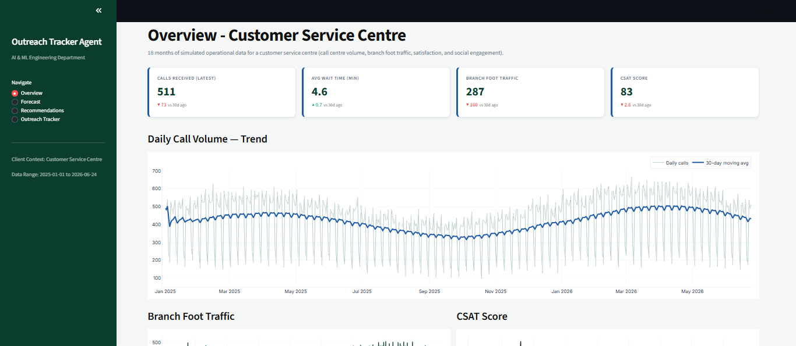
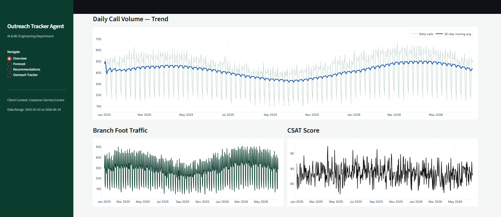
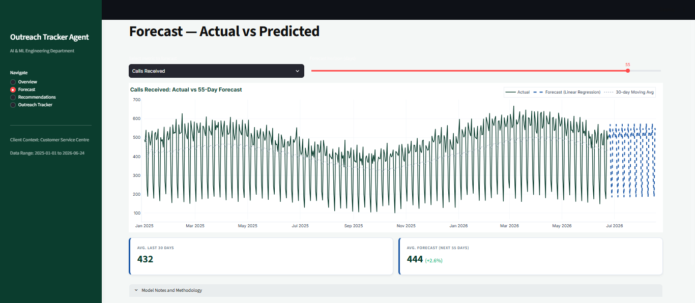
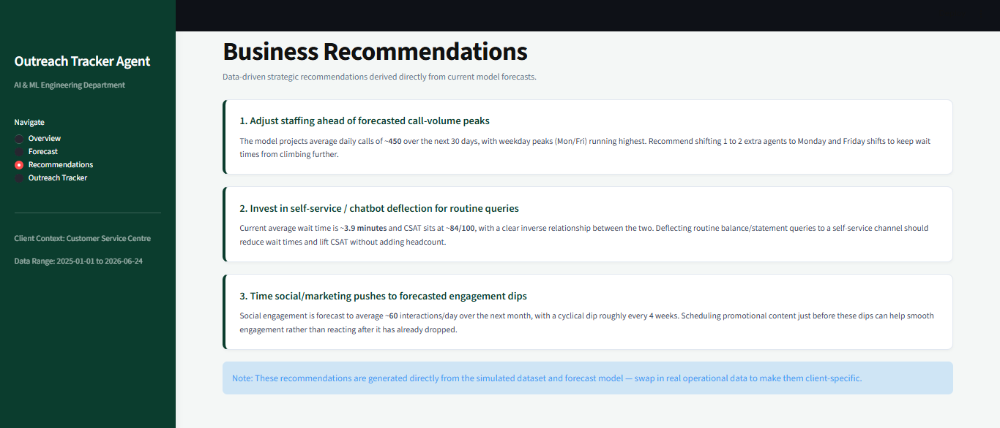
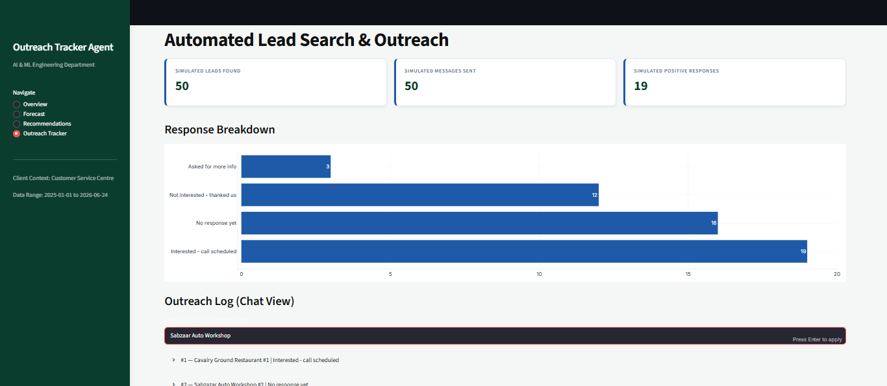
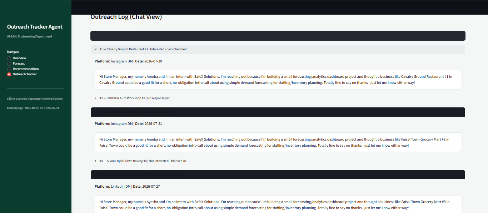
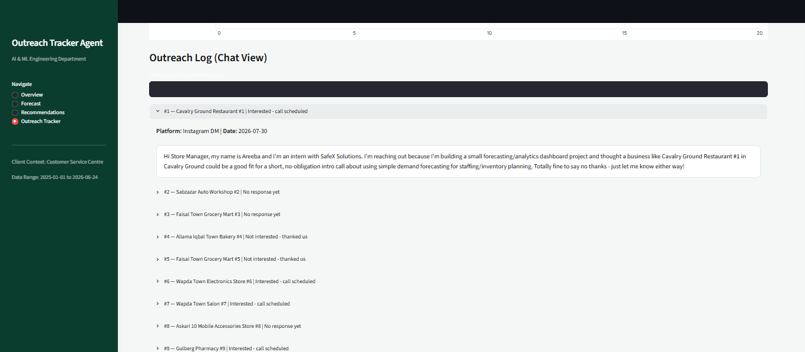
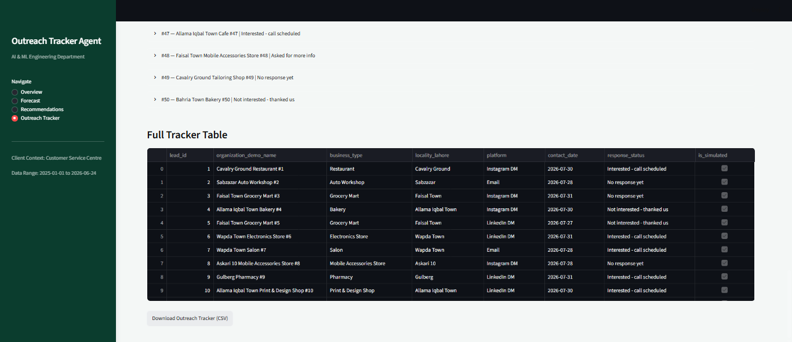

# Outreach Tracker Agent

An interactive, real-time analytics dashboard built for a customer service
centre - combining operational forecasting (call volume, wait times, foot
traffic, satisfaction) with an automated lead search & outreach tracking
module.


## Screenshots

## Overview tab





## Forecast tab



## Recommendation tab



## Outreach Tracker tab









Built with **Python, Streamlit, scikit-learn, and Plotly.**

---

## Overview

This project brings together two things a customer service operation
needs on a daily basis:

1. **Forecasting & performance visibility** - a live dashboard that tracks
   call volume, wait times, foot traffic, and satisfaction (CSAT) trends,
   and forecasts where each metric is heading over the next 7–60 days
   using a moving average + linear regression model.

2. **Automated lead search & outreach tracking**-— a module that logs
   prospective leads, the outreach message sent to each one, the platform
   used, and the response received, all in one searchable tracker with
   live filtering and CSV export.

Everything is interactive: switch metrics, adjust the forecast horizon,
filter the outreach log, and the dashboard updates instantly.

---

## Features

- **Live KPI cards** - calls received, average wait time, foot traffic,
  CSAT, with day-over-day change indicators
- **Forecasting engine** - actual vs. predicted charts for any tracked
  metric, adjustable forecast horizon (7–60 days)
- **Auto-generated recommendations** - business recommendations that
  update based on the current forecast numbers
- **Outreach tracker** - searchable log of leads, messages sent,
  platform, contact date, and response status, with a downloadable CSV
- **Custom themed UI** - white background with dark green, blue, and
  black accents, built with custom CSS on top of Streamlit

---

## Tech Stack

| Layer        | Tool                                                      |
| ------------ | --------------------------------------------------------- |
| Language     | Python 3.13                                               |
| Dashboard/UI | Streamlit                                                 |
| Forecasting  | scikit-learn (Linear Regression) + pandas moving averages |
| Charts       | Plotly                                                    |
| Data         | pandas, numpy                                             |

---

## Project Structure

```
outreach-tracker-agent/
├── data/
├── model/
├── dashboard/
│   └── app.py
├── outreach/
├── reports/
├── requirements.txt
├── .env.example
├── .gitignore
└── README.md
```

---

## Setup & Run

```bash
# 1. Clone the repo
git clone https://github.com/YOUR-USERNAME/outreach-tracker-agent.git
cd outreach-tracker-agent

# 2. Create and activate a virtual environment
python -m venv venv
venv\Scripts\Activate.ps1        # Windows PowerShell
# source venv/bin/activate       # Mac/Linux

# 3. Install dependencies
python -m pip install -r requirements.txt

# 4. Add environment variables
copy .env.example .env            # Windows
# cp .env.example .env            # Mac/Linux

# 5. Run the dashboard
streamlit run dashboard/app.py
```

The app opens automatically at `http://localhost:8501`.


---

## Roadmap

- [ ] Connect to a live data source (real-time call centre feed)
- [ ] Wire up real email/CRM sending for the outreach module
- [ ] Add authentication for multi-user access
- [ ] Deploy to Streamlit Community Cloud / a cloud VM

---

## Author

**Hafiz Muhammad Faizan**

- Portfolio: https://www.hafizmfaizan.site
- LinkedIn: https://www.linkedin.com/in/hafiz-muhammad-faizan/
- GitHub: https://github.com/thehmfpk
- Email: thehmfpk@gmail.com
